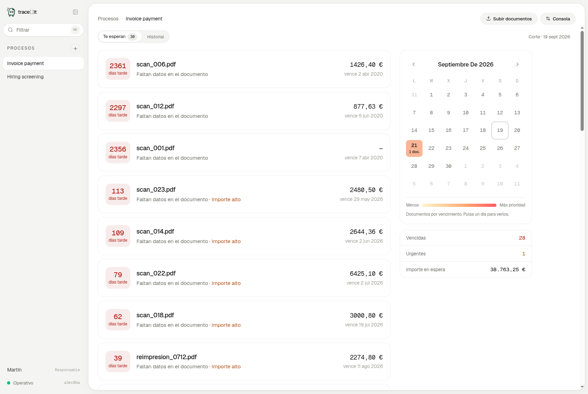
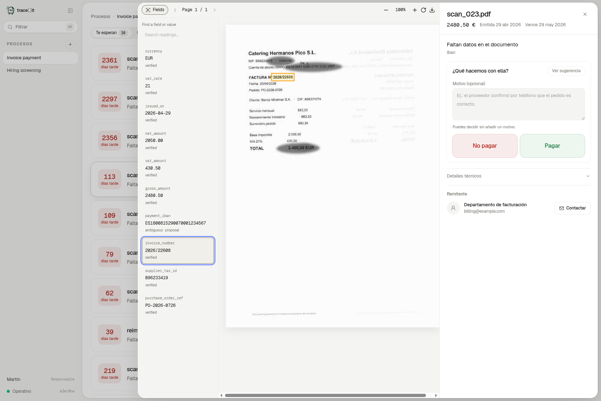
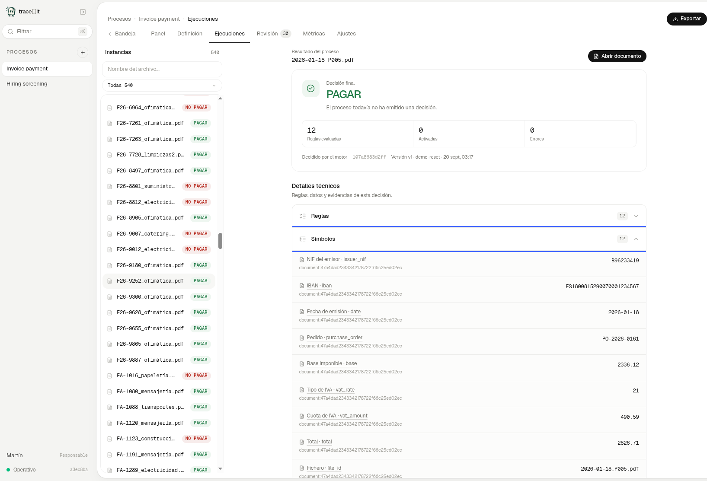
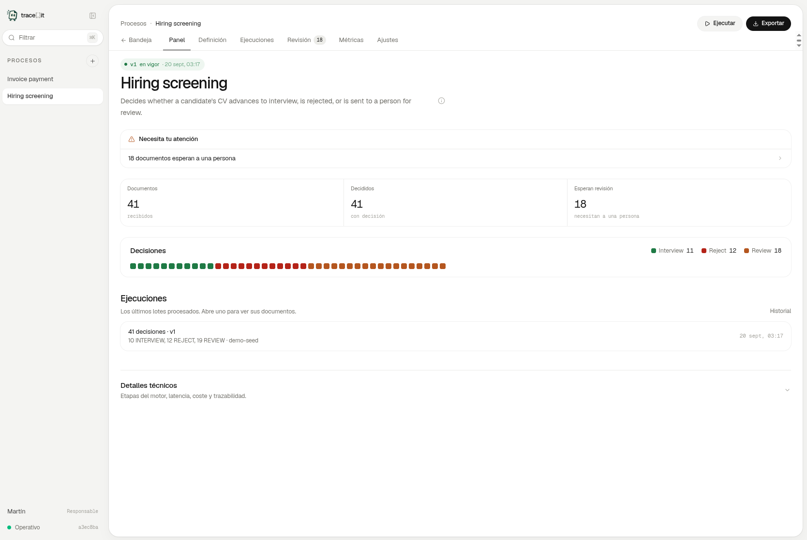

# trace-it

Turn operating policy into deterministic decision processes that evolve over time, with reliable ingestion of
any document and AI-augmented decision-making.

Describe a process in plain language, provide documents in any format, and connect its data
sources automatically. trace-it reads the material and proposes the outcomes, inputs, source bindings, and
rules needed to formalize a process. 

We enable trazability of every decision, monitorability of cost and latency and as versioning with backtesting
so the user can see which past decisions would change and why before publishing it.

[Open the live demo](https://gex-dashboard.hopto.org/nexia/trace-it/) ·

## How it works

1. **Describe.** A manager explains the process and provides policies, examples, documents
   in any format, and data sources.
2. **Formalize.** Agents propose a process definition with decision types, symbols, source
   bindings, and plain-language rules. The manager reviews every part.
3. **Publish.** Agents compile the rules to tested Python. The manager previews their effect
   on past cases and publishes one complete version.
4. **Run.** The engine evaluates each case in a sandbox and records the result, evidence,
   rule versions, and source snapshots. Uncertain cases go to a person.
5. **Improve.** Human resolutions and new evidence can become proposed process changes.
   Nothing changes until a manager reviews and publishes a new version.

The first process pack handles the invoice-payment challenge from "500 Sombras de Alberto".
The same application also runs hiring screening and other process packs without changing the
engine.

## See it in action

| Invoice queue | Document review |
|---|---|
|  |  |
|  |  |

