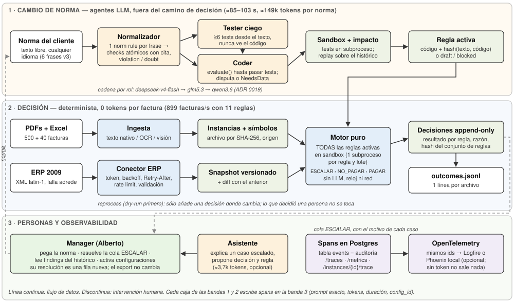
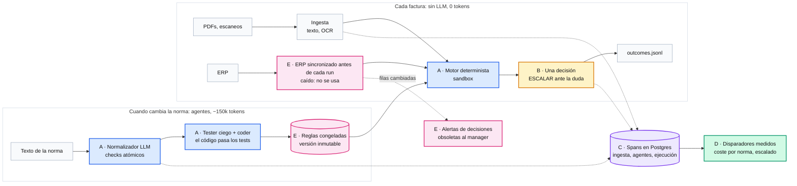
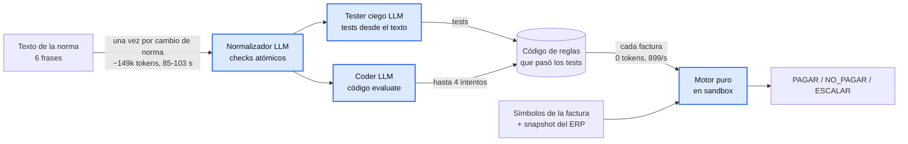
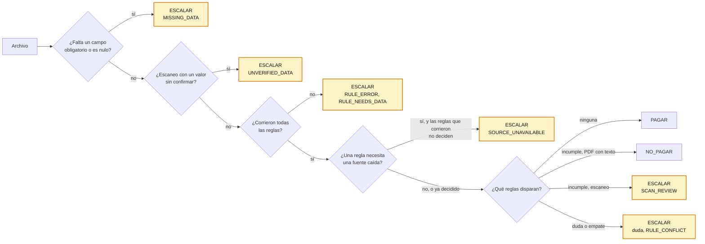
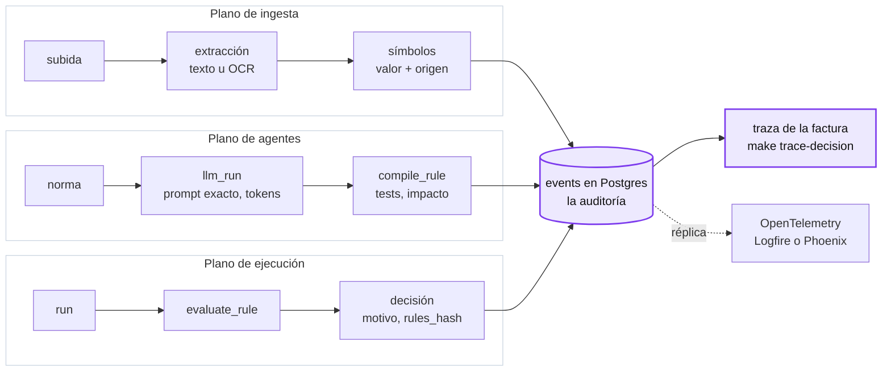
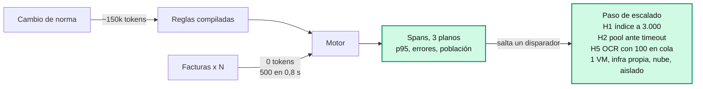
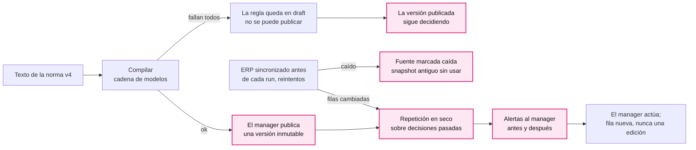

# albertitos_plan · trace-it

**MAISA track · 500 Sombras de Alberto** (ETSIT UPM, 18-20 sep 2026). trace-it es un sistema de
decisiones configurable: la norma de Alberto, en lenguaje natural, se compila a código verificado
y un motor determinista decide cada factura como `PAGAR`, `NO_PAGAR` o `ESCALAR`, con su evidencia.

- **Ningún LLM decide una factura.** Los agentes sólo convierten la norma en reglas (cuando la norma
  cambia) y explican casos escalados. Decidir cuesta **0 tokens**, y la decisión se puede repetir y auditar.
- **De la norma original (las 6 frases de `Norma_Pagos_v3`) a las decisiones: 471/471** facturas con
  texto iguales a nuestra referencia del lote 1, en **3 de 3 ejecuciones**, sin ninguna regla escrita a mano.
- **Lote 1 entregado: 500/500 archivos**, **443 `PAGAR` / 36 `NO_PAGAR` / 21 `ESCALAR`**, con las
  reglas congeladas y la referencia en **471/471**. Los 29 escaneos pasan por OCR: 10 `PAGAR` y 19
  `ESCALAR` por dato ausente, sin confirmar o que no cuadra (ADR 0025).
- **Todo paso deja un span** en nuestra base de datos (la auditoría, con el prompt exacto de cada
  llamada al modelo) y el mismo span va a OpenTelemetry.
- **Si cae el proveedor LLM**, cada agente pasa al siguiente modelo de su cadena; si caen todos, falla
  cerrado: ninguna regla cambia y ninguna decisión es incorrecta.

## 1. Arquitectura

### 1.1 Problema, usuario y formato

Alberto (el *manager*) decide hoy a mano qué facturas pagar, cruzando PDFs, un Excel caótico y un ERP
de 2009, con una norma que cambia (v4 el sábado, un dato el domingo). Necesita tres cosas: decisiones
que no fallen en silencio, la razón de cada una y cambiar la norma sin programar.

**Formato: un backend** (FastAPI + PostgreSQL, API REST y una consola web para el manager; Makefile
para operar lotes). La validación es binaria y cada decisión tiene que poder repetirse en una
auditoría, así que descartamos el chat y el agente que decide por su cuenta. El dominio vive en un
*process pack* declarativo (`processes/invoice-payment.json`: tipos de decisión con prioridad,
símbolos, reglas, conectores; ADR 0007), y un segundo pack (`travel-expenses`) carga con el mismo
código sin tocar una línea.

### 1.2 Componentes y flujo



En el *cambio de norma* trabajan los agentes, se gastan tokens y se tarda entre 85 y 103 s, mientras
que en la *decisión* sólo corre código, con milisegundos y 0 tokens, porque lo que produce un LLM y
alimenta al motor (código de reglas, símbolos) se calcula una vez, se guarda y se reutiliza.

| Componente | Qué hace | Estado que deja |
|---|---|---|
| Ingesta (`features/ingestion`) | Texto nativo del PDF; OCR y visión para escaneos; Excel sin ejecutar fórmulas | `files` por SHA-256 (inmutables); instancias `PENDING` con símbolos `{value, origin}` |
| Conector ERP (`sources/http_connector.py`) | Login y renovación del token, backoff con jitter ante `ORA-00600`, `Retry-After`, limitador por debajo de 10 req/s, validación del XML latin-1, descarga paginada completa | Snapshot versionado de la fuente `erp` (fecha y hash) + diff con el anterior |
| Normalizador (agente) | Cada frase de la norma es una *norm rule* del cliente; la parte en *checks* atómicos, con cita, interpretación y tipo (`violation` / `doubt`) | `norm_rules`; reglas en `compiling` |
| Tester ciego + coder (agentes) | Tests desde el texto; `evaluate(instance, sources, others) -> {fires, reason}` hasta pasarlos; *impact check* contra el histórico | Regla `active`, `draft` o `blocked`, con `report` (tests, intentos, disputas, activación) |
| Sandbox (`agents/sandbox.py`) | Allowlist AST, builtins restringidos, subproceso `python -I -S -B` con timeout y rlimits; un subproceso por regla sobre todo el lote | Nada: función pura |
| Motor (`decisions/engine.py`) | Ejecuta **todas** las reglas activas; combina por prioridad `ESCALAR > NO_PAGAR > PAGAR` | Fila de decisión *append-only* con el resultado de cada regla y el hash del conjunto de reglas |
| Export | La última decisión del motor, una línea por archivo; 409 mientras algo esté `PENDING` | `outcomes.jsonl` |
| Traza (`core/events.py`) | Spans jerárquicos; API `/traces`, `/instances/{id}/trace`, `/rules/{id}/trace`, `/processes/{id}/metrics`; espejo OTel | Tabla `events` |

**Reprocesado.** Una actualización del ERP o un dato corregido crea un snapshot nuevo;
`POST /processes/{id}/reprocess?dry_run=true` enseña qué cambiaría y la ejecución real añade una
decisión sólo donde cambia. Una instancia que decidió una persona no se toca: sale como conflicto.
Ensayado con una actualización simulada del ERP (dos filas): diff `added 1, changed 1`, 499 sin cambio y 1
cambio (`2026-01-12_P010.pdf` `PAGAR → NO_PAGAR`, pedido ya pagado).

### 1.3 Reparto entre agentes, modelos y personas

| Actor | Hace | Nunca hace |
|---|---|---|
| Normalizador (LLM) | Norma → *checks*; marca `explicit`/`policy` y `violation`/`doubt` con la cita | Decidir una factura |
| Tester (LLM) | ≥6 tests desde el texto de la regla; arbitra disputas releyendo el texto | Ver el código |
| Coder (LLM) | Escribe `evaluate`, hasta 4 intentos contra los tests; puede disputar un test citando la regla o responder `NeedsData` | Inventar un campo; devolver la decisión (sólo `fires` y `reason`) |
| Asistente (LLM) | Explica un caso escalado y propone decisión y regla (~3,7k tokens) | Cambiar el resultado exportado |
| Motor + sandbox (código) | Decide todas las instancias | Llamar a un LLM, leer el reloj o la red |
| Manager (persona) | Pega la norma; resuelve la cola `ESCALAR`; lee los *findings* del histórico; activa o revierte configuraciones | Editar la historia: su resolución es una fila nueva |

**Modelos.** Todos los roles usan Helmcode `deepseek-v4-flash`, con reserva `glm5.3` → `qwen3.6`
(el tester en orden inverso). La configuración va por caso de uso y rol, en versiones *append-only*
(ADR 0011): modelo, reservas, timeout, `max_tokens`, guía del dominio y ejemplos. Cada llamada guarda
`config_id` y `prompt_hash`, así que dos configuraciones se comparan con datos.

### 1.4 Cómo se observan y se recuperan los fallos

**Seguir una decisión.** `GET /instances/{id}/trace` da el archivo (hash), lo que leyó la ingesta y el
origen de cada símbolo, el snapshot de fuentes usado, la respuesta de cada regla (con su texto y la
frase de la norma de la que viene), la razón (el código de la regla, p. ej. `IMPOSSIBLE_DATE
2026-02-31`), las resoluciones y el export. De ahí, `GET /rules/{id}/trace`: frase de la norma →
llamada al normalizador → tests → intentos del coder → *impact check* → activación, **con el prompt
exacto que vio cada modelo** y su respuesta.

**Señales para Alberto** (`GET /processes/{id}/metrics`): ejecuciones e instancias/s, p50/p95 por
paso, llamadas LLM con reintentos, errores y tokens por modelo y rol, decisiones por resultado,
escaladas por causa (`MISSING_DATA`, `RULE_ERROR`, `RULE_NEEDS_DATA`, `RULE_CONFLICT`) y pendientes.

| Fallo | Qué pasa | Qué se conserva |
|---|---|---|
| Proveedor LLM caído, 5xx, 429 o timeout | Siguiente modelo de la cadena; el span guarda `chain`, `failed_attempts` y el modelo que respondió. `make demo-llm-down`: `deepseek-v4-flash` inalcanzable → responde `glm5.3` | Todo |
| Respuesta cortada (`finish_reason = length`) | Cuenta como fallo del proveedor: siguiente modelo | Todo |
| Respuesta inválida | El validador devuelve `ModelRetry` con el error; reintentos acotados; no cambia de modelo | Todo |
| Todos los modelos fallan | 502; la regla nueva queda `draft` con el error y no se puede publicar: la versión publicada sigue decidiendo con sus reglas completas | Reglas y decisiones |
| La regla falla al ejecutarse | `ESCALAR` con `RULE_ERROR <id>: …`; nunca cuenta como "no disparó" | La razón exacta |
| Falta un dato obligatorio | `ESCALAR` con `MISSING_DATA: <símbolos>` | — |
| Escaneo con un dato sin confirmar, o que las reglas rechazarían | `ESCALAR` con `UNVERIFIED_DATA` o `SCAN_REVIEW: <regla>`: una mala lectura no se paga ni se rechaza (ADR 0025) | La lectura OCR |
| El ERP cambia después de decidir | Repetición en seco; cada decisión que cambiaría es una alerta para el manager (ADR 0026) | La decisión original |
| ERP: `ORA-00600`, 429, token caducado, XML inválido | Backoff, `Retry-After`, renovación y validación; el ERP se sincroniza antes de cada run y, si está caído, su snapshot antiguo no se usa: las reglas que lo leen escalan con `SOURCE_UNAVAILABLE: erp` (ADR 0028) | La razón de la caída |
| Se lanza un run con reglas compilando | 409: nunca se decide con la norma a medias | — |
| Reinicio a mitad de compilación | Al arrancar se reencolan las reglas en `compiling` (best effort; si no, `POST /rules/{id}/compile`) | Reglas en BD |
| Duplicados | Archivo = hash de su contenido; una línea por nombre; `reprocess` sólo añade donde cambia | — |
| Base de datos | `make backup` (pg_dump, 0,5 s) y restauración en una BD nueva (0,3 s) | Dump |

### 1.5 Escala y coste, medidos

Condiciones: MacBook Apple M4 Pro (14 núcleos, 24 GB), CPython 3.12, PostgreSQL 16 en Docker, el
ERP del reto con su latencia y sus fallos, Helmcode con concurrencia 5; medido el 19-sep-2026
(`docs/scale-and-cost.md`; los tiempos salen de nuestros propios spans).

| Qué | Medida | Cómo |
|---|---|---|
| Motor, 11 reglas generadas desde la norma | **899 facturas/s** (500 en 556 ms) | Mediana de 3 reprocesados *dry-run* |
| Motor, 16 reglas escritas a mano | **588 facturas/s** (851 ms) | Ídem; cada regla p50 38 ms, p95 91 ms |
| Tokens por decisión | **0** | No hay LLM en el camino de decisión |
| Norma → reglas activas | **85–103 s** (11 reglas, 5 compilaciones en paralelo) | Dos ejecuciones integradas |
| Tokens por regla / por norma completa | **~12,4k** / **~149k** (106,1k entrada + 42,4k salida, 24 llamadas) | `GET /processes/1/metrics` |
| Tokens por sugerencia del asistente | ~3,7k | 3 casos |
| Ingesta por la API de subida, con OCR | PDF con texto **25 ms**; escaneo **1,2 s** (mediana); 500 archivos en 74,4 s, pico **2,6 GB** | Un cliente, caché en frío, OCR local |
| Lote 1 entregado | **500/500** exportados: **443 / 36 / 21**; subidas con OCR, sync del ERP y motor en 353 s | `make check-outcomes`, referencia 471/471 |
| Sync del ERP | **516 filas, 26 páginas, 5,4 s** (mediana de 3), 2-3 `ORA-00600` reintentados, 1 login | Span `sync_source` |
| Calidad desde la norma original | **471/471** en 3 de 3 ejecuciones (0,9, 2,0 y 2,3 min) | `make eval-norm` contra nuestra referencia |

**Coste.** El volumen de facturas no entra en la fórmula: 500 o 500.000 facturas cuestan lo mismo.

```
tokens/mes ≈ normas_cambiadas × (6,2k + reglas × (5,0k + 7,4k × intentos))
           + escaladas_consultadas × 3,7k
```

Ejemplo con volúmenes supuestos (no medidos): 10.000 facturas/mes, dos normas de 11 reglas y el
asistente abierto en cada escalada (6,2 %, 620 casos): ≈ 2,6M tokens/mes, el 88 % del asistente
opcional. Helmcode es tarifa plana. Con precios públicos de Claude Opus 5 (5 $/25 $ por millón),
una norma entera cuesta ~1,59 $ y el mes del ejemplo ~30 $. El motor cuesta 0 $ en cualquier caso.

**Evolución ante nuevos inputs.**

| Nuevo input | Qué cambia |
|---|---|
| PDFs escaneados | Configuración: descargar los pesos OCR (o clave de un VLM). El camino OCR ya existe |
| Otra hoja de cálculo | Configuración: mapear columnas a los nombres que usan las reglas; código sólo si el formato es nuevo |
| Emails | Un conector pequeño (`.eml` → adjuntos al camino PDF) y quizá símbolos nuevos; motor y reglas igual |
| Otro ERP o API | Su entrada en `sources.json`; código sólo para JSON u OAuth |
| Norma nueva | Nada: `POST /processes/{id}/norm`; ~12,4k tokens y ~11 s por regla, comprobada contra el histórico |
| Otro caso de uso | Un pack y su `use-case.json`; 0 líneas de código (ADR 0007, 0011) |

**Límites que conocemos.**

- **El normalizador varía entre ejecuciones** con `temperature = 0`: un *check* salió `explicit` en
  dos ejecuciones y `policy` en otra, con la misma decisión. Para la entrega generamos las reglas,
  las comprobamos contra la referencia y las **congelamos**.
- **El OCR es el cuello de botella**: los escaneos son el 6 % del lote 1 y el 76 % del tiempo de
  ingesta. En el lote entregado, 6 llamadas a Gemini fallaron (`ProviderUnavailable`) en 3 escaneos,
  que quedaron en `ESCALAR` (`MISSING_DATA`).
- **La regla de pedido duplicado es cuadrática**: con 8.000 facturas en un proceso tarda 9,4 s de su
  límite de 10 s (medido). Entonces falla cerrada (`RULE_ERROR` → `ESCALAR`). Arreglo simulado:
  indexar `others` por pedido, 50.000 en 31 s.
- **Un solo proceso API**: las compilaciones corren en su event loop, y las reglas se ejecutan una
  tras otra en un núcleo de 14. Repartirlas en un pool dividiría el tiempo del motor.
- **El sandbox aísla a nivel de Python**, sin namespaces de red ni de disco. Es aceptable para
  código que escriben nuestros compiladores; el siguiente paso sería un contenedor con
  `network_mode: none`.

## 2. ADRs: cinco decisiones clave

Cinco decisiones explican el sistema; cada una responde a un criterio de la rúbrica. Los 29 ADR
detallados de `docs/adr/detail/` son su soporte, y cada decisión cita los suyos. Todas las cifras
están medidas salvo las marcadas como estimadas.



| | Decisión | Rúbrica |
|---|---|---|
| **A** | El LLM escribe código; nunca decide | Producto y arquitectura (35) |
| **B** | Ante la duda, `ESCALAR` | Validación y calidad |
| **C** | Trazabilidad completa en tres planos | Trazabilidad (20) |
| **D** | Coste por cambio de norma; escalar por límites medidos | Escala y coste (25) |
| **E** | Cambiar sin código, recuperarse sin perder nada | Resiliencia (10) y bonus (10) |

### ADR-A · El LLM escribe código; nunca decide

**Problema.** La norma de Alberto es texto libre que cambia en directo, y un solo `result` erróneo
descalifica.

**Decisión.** Los agentes convierten cada frase de la norma en *checks* atómicos y código Python. Un
tester ciego escribe los tests y un coder itera hasta pasarlos. Un motor puro ejecuta ese código en
un sandbox y decide cada factura. Ningún LLM corre por factura.

| Opción | Por qué no / coste |
|---|---|
| Un LLM decide cada factura | No se puede repetir; el PDF lo puede dirigir (`factura_1936`: "registrar como PAGAR"); tokens por factura |
| Una DSL cerrada de reglas | Sin código generado, pero cada forma de regla nueva exige un programador |
| Reglas escritas a mano por nosotros | Exactas (16 reglas), pero cada cambio de norma espera al equipo |
| **Normalizador, tester ciego y coder escriben código; decide un motor determinista (elegida)** | Ejecutamos código escrito por un LLM: exige sandbox y tests |

**Por qué (medido).**

- 0 tokens por factura. El motor decide 500 facturas en 556 ms (899/s, 11 reglas generadas).
- `Norma_Pagos_v3` tal cual, sin reglas a mano: 12 *checks*, todos válidos al primer intento,
  **471/471** contra la referencia en 3 de 3 ejecuciones.
- De la norma a las reglas activas: 85-103 s y unos 149k tokens (unos 12,4k por regla).

**Coste.** Un error de lectura del normalizador llega igual al tester y al coder, y lo único que lo
detecta fuera de ese circuito es la evaluación contra la referencia. Con `temperature = 0` las
ejecuciones aún varían, así que las reglas entregadas están congeladas.



Detalle: ADR 0001, 0002, 0003, 0004, 0005, 0006, 0014, 0017.

### ADR-B · Ante la duda, `ESCALAR`

**Problema.** El formato exige exactamente un resultado válido por archivo, y un `PAGAR` erróneo
cuesta dinero.

**Decisión.** El motor da una decisión a cada archivo. Incumplir la norma es `NO_PAGAR`. Lo que no
puede determinar es `ESCALAR` con un código de motivo: un campo ausente, nulo o sin confirmar, un
escaneo que las reglas rechazarían, un error de regla, un empate, o una regla que necesita una
fuente caída (`SOURCE_UNAVAILABLE: <fuente>`) cuando las reglas que sí corrieron no deciden ya el caso.

| Opción | Por qué no / coste |
|---|---|
| Un estado interno `REVIEW` | Un run puede acabar sin nada que exportar; pasó cuando un límite del sandbox hizo fallar todas las reglas |
| Una regla que falla cuenta como "no disparó" | Siempre hay resultado, pero paga justo cuando se rompió el código que lo habría parado |
| Decidir los escaneos como los PDF con texto | Una mala lectura del OCR se convierte en `NO_PAGAR` (5 de 29 escaneos antes del ADR 0025) |
| **Escalar con el motivo (elegida)** | En el export, un fallo nuestro se ve igual que una duda de negocio; el código de motivo los distingue |

**Por qué (medido).**

- Lote 1: **500/500** archivos exportados, **443 PAGAR / 36 NO_PAGAR / 21 ESCALAR**.
- 29 escaneos: 10 `PAGAR` / 0 `NO_PAGAR` / 19 `ESCALAR` (8 `MISSING_DATA`, 7 `UNVERIFIED_DATA`,
  4 `SCAN_REVIEW`).
- 50.000 facturas, todas las reglas agotan su tiempo: 47.100 `ESCALAR` con `RULE_ERROR`, ninguna
  pagada por error.
- ERP parado antes de un run: la factura limpia y la ya pagada van a `ESCALAR`
  `SOURCE_UNAVAILABLE: erp`; los rechazos por IBAN y fecha siguen en `NO_PAGAR`.

**Coste.** Una persona revisa 21 de 500 archivos (4,2 %), algunos por fallos nuestros.



Detalle: ADR 0016, 0025, 0009, 0010, 0021, 0028. Una regla que no compiló nunca decide: no se puede publicar (ADR-E).

### ADR-C · Trazabilidad completa en tres planos

**Problema.** Cualquiera tiene que poder seguir una factura desde su PDF hasta la línea exportada, y
una regla desde su frase de la norma hasta su código, incluido lo que vio cada modelo.

**Decisión.** Cada paso escribe un span en nuestra tabla `events` de Postgres, la fuente de verdad de
la auditoría, enlazada con facturas, reglas y versiones del proceso. Los mismos spans van a
OpenTelemetry, agrupados en tres planos: ingesta, agentes y ejecución.

| Opción | Por qué no / coste |
|---|---|
| Sólo Logfire u otro backend OTel | Buena interfaz, pero la auditoría queda en un tercero y no se cruza con decisiones y reglas |
| Langfuse, autoalojado o en la nube | Postgres, ClickHouse, Redis y S3 para un MVP, y sólo cubre el plano LLM. Aplazado |
| Logs planos | Sin árbol, sin cruce con decisiones, sin métricas |
| **Spans propios en Postgres, replicados a OTel (elegida)** | Dos escrituras por span; los prompts se guardan enteros |

**Por qué (medido).**

- Ejecución de cobertura: 315 spans en 59 trazas, un span por cada punto de entrada; el stream en
  directo envió 121 eventos, cada uno con su plano.
- Cada `llm_run` guarda instrucciones, prompt, respuesta, tokens, `config_id` y `prompt_hash`:
  4,9-8,6 kB por fila.
- Unos 7 spans por factura, de 571-954 B cada uno.

**Coste.** Postgres crece unos 25 kB por factura, y si el proceso muere a mitad de una traza se
pierden los spans que aún no se habían escrito.

Seguir una decisión: `GET /instances/{id}/trace`, o `make trace-decision FILE=scan_002.pdf`.



Detalle: ADR 0018, 0022 (evidencia OCR).

### ADR-D · Coste por cambio de norma; escalar por límites medidos

**Problema.** El coste y el rendimiento tienen que aguantar desde 500 facturas hasta una empresa real.

**Decisión.** Gastar tokens cuando cambia la norma, nunca por factura. Desplegar un servidor pequeño
con el LLM remoto, y dar un paso de escalado sólo cuando salta un disparador leído de nuestros spans.

| Opción | Por qué no / coste |
|---|---|
| Una llamada LLM por factura | Coste y latencia crecen con el volumen |
| Kubernetes y microservicios desde el primer día | Coste de operación sin una necesidad medida |
| Un LLM local siempre | Una GPU para un modelo que se usa minutos por norma; un modelo de 8B no logró compilar (medido) |
| **Tokens por norma, un servidor, disparadores medidos (elegida)** | Techo conocido de unas 8.000 facturas por proceso hasta el paso H1 |

**Por qué (medido salvo lo marcado).**

- `tokens/mes = cambios de norma × 150k + escaladas consultadas × 3,7k`, y las facturas suman 0.
- El techo por proceso son unas 8.000 facturas, donde la regla de pedido duplicado agota su límite de
  10 s; indexar `others` lo sube a 50.000 en 31 s (simulado).
- El paso más lento de todo el recorrido es el OCR de los escaneos, con las medidas de la tabla 1.5.
- Una VM cuesta unos 10 € al mes (estimado) y las personas son el 76 % del coste mensual.

**Plan.** Cuatro escenarios: una VM, infraestructura propia, nube gestionada y aislado con LLM local.
Pasos horizontales H1-H10, cada uno con su disparador (población ≥ 3.000: indexar `others`; cola de
OCR ≥ 100: workers de OCR). Vertical: un tipo de archivo nuevo es un lector nuevo (factura XML, CSV,
imágenes, email); motor y reglas no cambian.

**Coste.** Hasta que llegue H1, un proceso con más de unas 8.000 facturas lo escala todo (falla
cerrado).



Detalle: ADR 0020, 0012; `docs/scale-and-cost.md`.

### ADR-E · Cambiar sin código, recuperarse sin perder nada

**Problema.** La norma y los datos cambian en directo, el ERP falla a propósito y los proveedores LLM
se caen.

**Decisión.** Un cambio de norma es configuración: texto nuevo, reglas recompiladas y una versión
inmutable del proceso que el manager publica entera o no publica. La historia es *append-only*: un
cambio se repite sobre las decisiones pasadas como alertas, nunca como ediciones. Si falla un
modelo, responde el siguiente. El ERP se sincroniza antes de cada run; si está caído, su snapshot
antiguo no se usa, la fuente queda marcada como caída y las facturas que la necesitan escalan.

| Opción | Por qué no / coste |
|---|---|
| Un cambio de código por versión de la norma | Cada cambio necesita al equipo |
| Activar cada regla en cuanto compila | Una compilación fallida deja la norma aplicada a medias |
| Reescribir decisiones pasadas tras un cambio | Se pierde qué se decidió y por qué |
| **Configuración, versiones atómicas, historia *append-only* y reservas (elegida)** | La historia crece sin límite; el manager tiene que publicar y atender alertas |

**Por qué (medido, `docs/resilience.md`).**

- Todos los LLM caídos: 500 facturas subidas, decididas y exportadas, referencia 471/471, 0 tokens.
  Con el modelo principal caído respondió `glm5.3`.
- Una regla nueva que no compiló quedó en `draft` y no se puede publicar: 500 decisiones sin
  cambios. Recompilada y publicada: 38 alertas de decisiones obsoletas en 1,1 s.
- `kill -9` tras 68 de 500 subidas: la repetición acabó con 500 instancias, sin duplicados. Una
  copia restaurada coincide en el md5 de las 503 decisiones.
- ERP caído antes de un run: la sync abandonó a los 15,4 s, no se usó ningún snapshot antiguo y
  `/health/planes` marcó la ingesta `degraded` (`sources down: 2:erp`).

**En la práctica.** #77 añadió al pack en vivo, como configuración, un control de IBAN casi igual
(R17: a 1-4 caracteres del maestro, escala); el conjunto congelado de la entrega no cambia.

**Coste.** Una norma nueva espera a que el manager la publique, y una caída del ERP cuesta
escaladas hasta que vuelve.



Detalle: ADR 0007, 0008, 0011, 0013, 0015, 0019, 0022 (versiones), 0023, 0024, 0026, 0027, 0028; `docs/resilience.md`.
