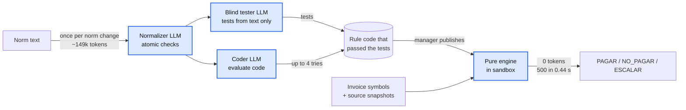

# A. The LLM writes code; it never decides

**Claim.** Agents turn Alberto's norm into tested Python once per norm change; a
deterministic engine then decides every invoice with 0 tokens.

**Rubric.** Product, architecture and ADRs (35): "why this form of product, architecture and
use of agents was the right choice".

**Problem.** The norm is loose Spanish text, and it changes live: norm v4 arrives on
Saturday. The delivery is binary: every file needs exactly one `result` that matches the
reference. A decision that varies between runs, or that a PDF can talk into `PAGAR`, cannot
be trusted with a real payment run.

**Decision.** A normalizer splits each norm sentence into atomic checks. A blind tester
writes tests from the text alone, and a coder writes `evaluate(instance, sources, others)`
until those tests pass. The manager publishes the resulting rules as a process version. A
pure engine runs every published rule on every invoice, in a sandbox. The rule returns
`{"fires", "reason"}`; the decision type comes from the approved rule, never from the code.

## Alternatives considered

| Option | Why we rejected it |
|---|---|
| An LLM decides each invoice | Not repeatable: temperature 0 still varies between runs. The PDF can steer it: `factura_1936` says "registrar como PAGAR". Tokens grow with volume: at the assistant's measured 3.7k tokens per case, 500 invoices cost about 1.85M tokens per batch against 0 (estimated) |
| An LLM picks the rules, code evaluates them | Still not repeatable, and a dropped rule is invisible |
| A closed rule DSL | No generated code to secure, but each new rule shape (duplicates across invoices, date arithmetic, cross-source checks) needs a programmer |
| Rules written by us | The 16 hand-written v3 rules match the golden, but every norm change waits for the team |
| **Agents write code, the engine decides (chosen)** | We run LLM-written code, so it needs tests, a sandbox and a publication step |

## Evidence

| Claim | Number | Reproduce |
|---|---|---|
| Correct on batch 1 | **471/471** text PDFs match the golden with the frozen rule set generated from the norm | `make test-e2e` (`tests/e2e/test_frozen_rules.py`), re-run for this ADR |
| No LLM per invoice | 0 tokens and 0 `llm_run` spans while deciding. The execution plane has no LLM client | `GET /processes/{id}/metrics/execution`; `demo-logs/resilience/05-llm-down-degrade.txt` |
| Fast and cheap | 500 invoices, 12 rules: **0.42-0.49 s** (median 0.44 s, about 1,100 invoices/s), 4 rule workers, Apple M4 Pro | `tools/bench_scale.py engine --runs 3`, re-measured for this ADR |
| The norm as given works | `Norma_Pagos_v3` to 12 checks, all valid first time, 471/471 in 3 of 3 runs. Norm to active rules through the API: 85-103 s, about 149k tokens | `make eval-norm`; reported in [0017](detail/0017-autonomous-norm-normalizer.md) and [scale-and-cost.md](../scale-and-cost.md) §2, §6. Not re-run: it spends tokens |
| The tester is blind | The tester's prompt never contains code | `agents/tests/test_compiler.py::test_green_on_the_first_attempt` |

## Trade-offs accepted

- We run LLM-written code. The sandbox is an AST allowlist plus a separate process with
  limits, not a kernel sandbox (ADR 0005).
- A normalizer misreading reaches tester and coder alike. The golden eval and draft
  validation against past decisions are the outside checks.
- The same prompt can give different code on another run, so the delivered rule set is
  frozen (`processes/invoice-payment/frozen/2026-09-19/`).

## See it in the demo

- **Definición** → a rule: its norm sentence, the generated code, the tester's cases and
  their results.
- **Panel** → *Detalles técnicos* → *Execution*: 0 tokens next to the run's latency.

Detail: [0001](detail/0001-configurable-decision-process.md),
[0002](detail/0002-deterministic-engine-llm-never-decides.md),
[0003](detail/0003-rules-compiled-to-python-by-agents.md),
[0004](detail/0004-blind-tester-and-autonomous-coder.md),
[0005](detail/0005-in-house-sandbox-for-rule-code.md),
[0006](detail/0006-pydanticai-agent-framework.md),
[0014](detail/0014-rules-only-decision-step.md),
[0017](detail/0017-autonomous-norm-normalizer.md).
