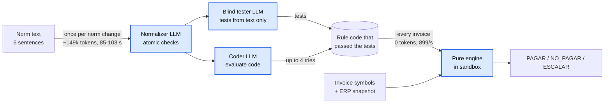

# A. The LLM writes code; it never decides

**Problem.** Alberto's norm is loose Spanish text that changes live, and one wrong `result`
disqualifies.

**Decision.** Agents turn each norm sentence into atomic checks and Python code. A blind
tester writes the tests, and a coder iterates until they pass. A pure engine runs that code
in a sandbox and decides every invoice. No LLM runs per invoice.

| Option | Why not / trade-off |
|---|---|
| An LLM decides each invoice | Not repeatable; the PDF can steer it (`factura_1936`: "registrar como PAGAR"); tokens per invoice |
| A closed rule DSL | No generated code, but each new rule shape needs a programmer |
| Rules hand-written by us | Exact (16 rules), but every norm change waits for the team |
| **Normalizer, blind tester and coder write code; a deterministic engine decides (chosen)** | We run LLM-written code, so it needs a sandbox and tests |

**Why (measured).**
- 0 tokens per invoice. The engine decides 500 invoices in 556 ms (899/s, 11 generated rules).
- `Norma_Pagos_v3` as given, no hand-written rule: 12 checks, all valid on the first
  attempt, **471/471** against the golden in 3 of 3 runs.
- Norm to active rules: 85-103 s and about 149k tokens (about 12.4k per rule).

**Cost.** A normalizer misreading reaches tester and coder alike; the golden eval is the
outside check. Temperature 0 still varies between runs, so the delivered rules are frozen.

Detail: [0001](detail/0001-configurable-decision-process.md),
[0002](detail/0002-deterministic-engine-llm-never-decides.md),
[0003](detail/0003-rules-compiled-to-python-by-agents.md),
[0004](detail/0004-blind-tester-and-autonomous-coder.md),
[0005](detail/0005-in-house-sandbox-for-rule-code.md),
[0006](detail/0006-pydanticai-agent-framework.md),
[0014](detail/0014-rules-only-decision-step.md),
[0017](detail/0017-autonomous-norm-normalizer.md).
