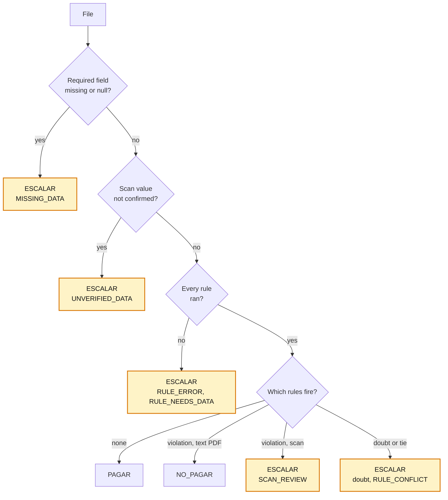

# B. When in doubt, ESCALAR

**Problem.** The format needs exactly one valid result per file, and a wrong `PAGAR` costs
money.

**Decision.** The engine gives every file one decision. Non-compliance is `NO_PAGAR`.
Anything it cannot determine is `ESCALAR` with a reason code: a missing, null or unconfirmed
field, a scan the rules would reject, a rule error or a tie.

| Option | Why not / trade-off |
|---|---|
| An internal `REVIEW` state | A run can end with nothing to export; it happened when a sandbox limit broke every rule |
| A rule that fails counts as "did not fire" | Always a result, but it pays exactly when the code that would stop it broke |
| Decide scans like text PDFs | An OCR misread becomes a `NO_PAGAR` (5 of 29 scans before ADR 0025) |
| **Escalate with the reason (chosen)** | In the export our own failure looks like a business doubt; the reason code tells them apart |

**Why (measured).**
- Batch 1: **500/500** files exported, **443 PAGAR / 36 NO_PAGAR / 21 ESCALAR**; golden
  **471/471**.
- 29 scans: 10 `PAGAR` / 0 `NO_PAGAR` / 19 `ESCALAR` (8 `MISSING_DATA`, 7
  `UNVERIFIED_DATA`, 4 `SCAN_REVIEW`).
- 50,000 invoices, every rule timed out: 47,100 `ESCALAR` with `RULE_ERROR`, none paid by
  mistake.

**Cost.** A person reviews 21 of 500 files (4.2 %), some of them for our own failures.

Detail: [0016](detail/0016-every-instance-gets-a-decision.md),
[0025](detail/0025-scan-decision-policy.md),
[0009](detail/0009-review-state-and-export-semantics.md),
[0010](detail/0010-double-extraction-with-deterministic-validators.md),
[0021](detail/0021-optional-decision-review.md). A rule that failed to compile never
decides: it cannot be published (key decision E).
