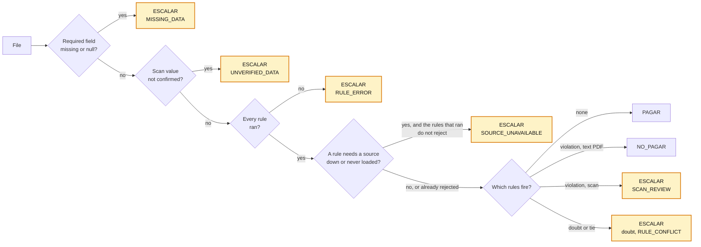

# B. When in doubt, ESCALAR

**Claim.** Every file gets exactly one decision. What the rules reject is `NO_PAGAR`; what
the system cannot determine is `ESCALAR` with a reason code, never a guess.

**Rubric.** Quality of execution (10): "do its decisions and limits make sense for
Alberto?". It also keeps the binary validation safe: one valid `result` per file.

**Problem.** The export needs exactly one valid `result` per file. A wrong `PAGAR` costs
money, and a run that ends with files left undecided cannot be delivered. Scans, empty
fields, a broken rule and an ERP that fails on purpose all happen in La Caja.

**Decision.** The engine gives every file one of the process's decision types. When it cannot
decide, it escalates and names the reason: `MISSING_DATA` (a required field is empty),
`UNVERIFIED_DATA` (a scan value the readers did not confirm), `SCAN_REVIEW` (a scan the rules
would reject), `RULE_ERROR` (rule code failed), `RULE_CONFLICT` (a tie between decisions) and
`SOURCE_UNAVAILABLE: <source>` (a source a rule needs is down or was never loaded, and the
rules that did run do not already reject). Missing reference data is unknown, never an empty
table. A person resolves the escalation in the console, as a new row.

**Update 2026-09-19 (ADR 0035).** Every reason code has a plain-Spanish explanation in Revisión, templated with no LLM. Only rule-based escalations can be learned; the engine's own codes (`MISSING_DATA`, `SOURCE_UNAVAILABLE`...) never can.

## Alternatives considered

| Option | Why we rejected it |
|---|---|
| An internal `REVIEW` state outside the export | A run can end with files that have no exportable result. It happened: a sandbox limit broke every rule (ADR 0009, superseded) |
| A rule that fails counts as "did not fire" | Always a result, but it pays exactly when the code that should stop the payment broke |
| Decide scans like text PDFs | An OCR misread becomes a wrong `NO_PAGAR`: 5 of 29 scans before ADR 0025 |
| Use the last ERP snapshot when the ERP is down | Pays against stale data, for example an invoice the ERP already marked paid |
| **Escalate with the reason (chosen)** | In the export our own failure looks like a business doubt; the reason code tells them apart |

## Evidence

| Claim | Number | Reproduce |
|---|---|---|
| One decision per file | Batch 1, the delivered run (`delivery/outcomes.jsonl`): 500 files, **436 `PAGAR` / 36 `NO_PAGAR` / 28 `ESCALAR`**, golden 471/471 | Counted on the delivered file; re-decided for this ADR with `tools/bench_scale.py engine` on the delivery database: 500 unchanged; `make test-e2e` |
| Every escalation says why | The 28: 26 `MISSING_DATA` (all of them scans) and 2 `RULE_MATCH`, the same purchase order on two invoices (a business doubt) | Counted on `delivery/outcomes.jsonl`; also the `reprocess` span's `failures` and `escalations`; `GET /processes/{id}/metrics/execution` |
| Scans never rejected on an OCR reading | 29 scans: 3 `PAGAR`, 0 `NO_PAGAR`, 26 `ESCALAR` | Same run; `decisions/tests/test_engine.py::test_a_scan_the_rules_would_reject_escalates_naming_the_rule` |
| A broken rule never pays | 50,000 invoices with every rule timing out: 47,100 `ESCALAR` `RULE_ERROR`, 0 paid | [scale-and-cost.md](../scale-and-cost.md) §3, reported; `test_engine.py::test_a_failing_rule_escalates_with_the_error` |
| A down source only affects what needs it | ERP down: the clean invoice and the already-paid one escalate `SOURCE_UNAVAILABLE: erp`; IBAN and date rejections stay `NO_PAGAR` | `decisions/tests/test_live_sources.py::test_erp_down_escalates_only_what_depends_on_it` |
| A never-loaded source is not an empty table | No workbook loaded: the invoice escalates instead of failing the supplier check | `test_live_sources.py::test_a_source_never_loaded_escalates_instead_of_reading_empty` |

A separate run with a better OCR reader gave 443 / 36 / 21, and one with Helmcode 444 / 36 / 20:
more scans confirmed, fewer escalations. Neither was the run we shipped, so the numbers above
are the ones in `delivery/outcomes.jsonl`. In the delivered run the scan reader hit its
provider's daily quota (HTTP 429), so seven scans it had corroborated earlier ended
`MISSING_DATA` instead of `PAGAR`.

## Trade-offs accepted

- A person reviews 28 of 500 files (5.6 %). 26 of them are our own limits (a scan whose
  fields the reader did not extract), not business doubts; only 2 are a real doubt.
  An independent audit agreed with all 471 text-layer invoices.
- In `outcomes.jsonl` both look the same: `ESCALAR`. The reason code, in the trace and the
  queue, tells them apart.

## See it in the demo

- **Revisión**: the queue of escalated cases, each with its reason code, the evidence, and
  the assistant's explained options. The manager resolves; the engine's decision stays.
- **Panel** → *Detalles técnicos* → *Execution*: escalations by reason.

Detail: [0016](detail/0016-every-instance-gets-a-decision.md),
[0025](detail/0025-scan-decision-policy.md),
[0009](detail/0009-review-state-and-export-semantics.md),
[0010](detail/0010-double-extraction-with-deterministic-validators.md),
[0021](detail/0021-optional-decision-review.md),
[0028](detail/0028-live-sources-sync-before-run.md),
[0029](detail/0029-bind-dynamic-extraction-to-published-execution.md),
[0030](detail/0030-report-partial-history-for-new-symbols.md). A rule that failed to
compile never decides: it cannot be published (key decision E).
