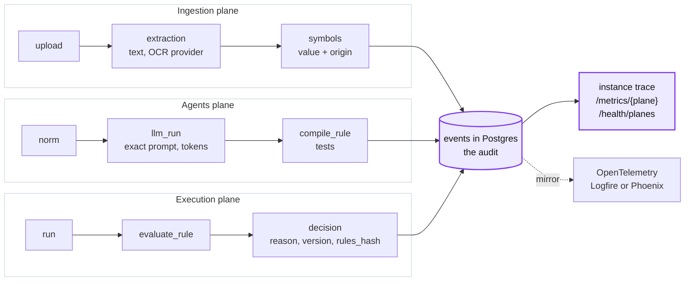

# C. Full traceability in three planes

**Claim.** Every step writes a span to our own Postgres table, joined to the invoice, the rule
and the process version. Any decision can be followed from its PDF to the exported line, and
any rule from its norm sentence to its code.

**Rubric.** Traceability and observability (20): "follow a decision from input to result"
and "which signals let Alberto detect errors, retries, pending work and cost".

**Problem.** Alberto must be able to answer "why was this invoice paid?" months later. He
also needs to see, while it runs, what failed, what was retried, what is still pending and
what it cost. LLM calls, OCR providers and the engine each fail and cost in different ways.

**Decision.** One span model (`events` table) for everything: upload, extraction, OCR
provider call, source sync, normalizer, tester, coder, run, rule evaluation, decision,
resolution, export. It is the audit source of truth. Each `llm_run` keeps the exact
instructions, prompt, output, tokens and model that answered. Spans are grouped into three
planes that are never added together: **ingestion** (reading documents and data),
**agents** (norm to code) and **execution** (deciding). The same spans are mirrored to
OpenTelemetry (Logfire or Phoenix) when configured.

## Alternatives considered

| Option | Why we rejected it |
|---|---|
| Only a hosted OTel backend (Logfire, Phoenix) | Good UI, but the audit sits with a third party and cannot be joined with decisions, rules and versions in SQL. We still mirror to it |
| Langfuse, self-hosted or cloud | Postgres, ClickHouse, Redis and S3 to run for an MVP, and it covers only the LLM plane, not OCR or the engine |
| Plain logs | No tree, no join with decisions, no metrics |
| One mixed dashboard | 214,734 tokens in one run reads as "every invoice costs AI". By plane: ingestion 52k (scans only), agents 162k (once per norm), execution **0** |
| **Own spans in Postgres, mirrored to OTel, three planes (chosen)** | Two writes per span; prompts stored whole |

## Evidence

| Signal the jury asks for | Where it is | Reproduce |
|---|---|---|
| Follow one decision | State, decision, rules that fired, evidence with page and position in the PDF, process version, `rules_hash`, latency per step, and `sources_read`: the ERP or workbook sync the decision read, with its retries and 429s | `GET /instances/{id}/trace`; `make trace-decision FILE=scan_002.pdf` |
| Errors | `errors` per step and per provider; `GET /health/planes`: `ok`, `degraded` or `down` per plane | `GET /metrics/{plane}` |
| Retries and rate limits | LLM `retries` and `fallbacks` (the model that answered); OCR `network_requests`, `replays`, `blocked` and `rate_limited` (HTTP 429) per provider; `sources[]`: syncs, retries and `rate_limited` per source of truth | `GET /metrics/agents`, `GET /metrics/ingestion`, `GET /traces?source=erp` |
| Pending work | `pending` (not decided yet), `escalated` (the human queue) with `escalation_reasons` (the queue by first reason code), `open_alerts` (stale decisions) | `GET /metrics/execution` |
| Cost | Tokens by plane, role, rule and model; `known_cost_usd` where the price is known; `unpriced_requests` counted, never read as 0 USD | `GET /metrics/agents`, `GET /metrics/ingestion` |
| Live | Server-sent events, one stream per plane | `GET /events/stream?plane=execution` |

Measured on the 500-invoice delivery database: 3,414 spans, about 7 per invoice; the
`events` table is 5.0 MB and the whole database 24 MB (re-measured for this ADR). A
coverage run found a span at every entry point: 315 spans in 59 traces (reported,
`demo-logs/coverage/`). One `llm_run` row with its full prompt is 4.9-8.6 kB (reported,
ADR 0018).

## Trade-offs accepted

- Postgres grows with every span and every prompt stored whole. History is append-only, so
  it grows without limit; the ceiling and its fix are in ADR 0020.
- A span not yet written is lost if the process dies mid-trace.
- The ingestion plane's health is an error ratio over all its spans. A few failed provider
  calls among thousands of spans still read `ok` (known gap, `docs/resilience.md`).

## See it in the demo

- **Ejecuciones** → a case: the PDF with each extracted field highlighted, next to the span
  tree, the rules and the decision.
- **Panel** → *Detalles técnicos*: three dashboards (Ingestion, Agents, Execution). Each
  number drills down to its spans in `/traces`.
- Terminal: `make trace-decision FILE=scan_002.pdf`.

Detail: [0018](detail/0018-observability-own-audit-spans-plus-opentelemetry.md),
[0022 OCR evidence](detail/0022-ocr-evidence-and-provider-tracing.md),
[0034 per-plane dashboards](detail/0034-per-plane-dashboards.md);
[observability-dashboards.md](../observability-dashboards.md).
