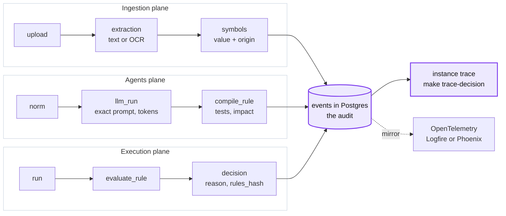

# C. Full traceability in three planes

**Problem.** Anyone must be able to follow an invoice from its PDF to the exported line, and
a rule from its norm sentence to its code, including what each model saw.

**Decision.** Every step writes a span to our own `events` table in Postgres, the audit
source of truth, joined to invoices, rules and process versions. The same spans go to
OpenTelemetry, grouped into three planes: ingestion, agents and execution.

| Option | Why not / trade-off |
|---|---|
| Only Logfire or another OTel backend | Good UI, but the audit sits with a third party and cannot join decisions and rules |
| Langfuse, self-hosted or cloud | Postgres, ClickHouse, Redis and S3 for an MVP, and it covers only the LLM plane. Deferred |
| Plain logs | No tree, no join with decisions, no metrics |
| **Own spans in Postgres, mirrored to OTel (chosen)** | Two writes per span; prompts stored whole |

**Why (measured).**
- Coverage run: 315 spans in 59 traces, a span for every entry point; the live stream sent
  121 events, each with its plane.
- Each `llm_run` keeps the instructions, prompt, output, tokens, `config_id` and
  `prompt_hash`: 4.9-8.6 kB per row.
- About 7 spans per invoice, 571-954 B each.

**Cost.** Postgres grows by about 25 kB per invoice. Spans not yet written are lost if the
process dies mid-trace.

Follow a decision: `GET /instances/{id}/trace`, or `make trace-decision FILE=scan_002.pdf`.

Detail: [0018](detail/0018-observability-own-audit-spans-plus-opentelemetry.md),
[0022 OCR evidence](detail/0022-ocr-evidence-and-provider-tracing.md).
