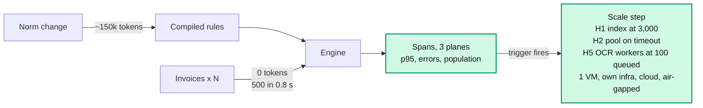

# D. Cost per norm, not per invoice; scale by measured limits

**Problem.** Cost and throughput must hold from 500 invoices to a real company.

**Decision.** Spend tokens when a norm changes, never per invoice. Deploy one small server
with a remote LLM, and take a scaling step only when a trigger read from our spans fires.

| Option | Why not / trade-off |
|---|---|
| An LLM call per invoice | Cost and latency grow with volume |
| Kubernetes and microservices from day one | Operations cost with no measured need |
| A local LLM always | A GPU for a model used minutes per norm; an 8B model failed to compile (measured) |
| **Tokens per norm, one server, measured triggers (chosen)** | Known ceiling of about 8,000 invoices per process until step H1 |

**Why (measured unless marked).**
- `tokens/month = norm changes × 150k + escalations asked × 3.7k`; invoices add 0.
  10,000 invoices and 2 norms a month: about 2.6M tokens (estimated).
- Engine: 500 invoices in 0.8 s. Ceiling: 8,000 per process, where the duplicate-order rule
  takes 9.4 s of its 10 s limit. The fix, simulated: 50,000 in 31 s.
- OCR is the bottleneck: 1.2 s per scan against 25 ms per text PDF, 2.6 GB peak RAM.
- One VM costs about €10 a month (estimated); people are 76 % of the monthly cost.

**Plan.** Four scenarios: one VM, own infrastructure, managed cloud, air-gapped with a local
LLM. Horizontal steps H1-H10, each with a trigger (population ≥ 3,000: index `others`; OCR
queue ≥ 100: OCR workers). Vertical: a new file type is a new reader (XML e-invoice, CSV,
images, email); engine and rules stay the same.

**Cost.** Until H1 ships, a process past about 8,000 invoices escalates everything (it
fails closed).

Detail: [0020](detail/0020-deployment-and-scaling-plan.md),
[0012](detail/0012-stack-and-feature-based-structure.md);
[scale-and-cost.md](../scale-and-cost.md).
