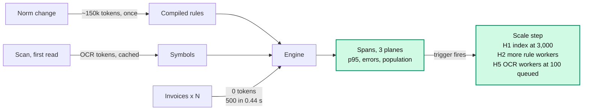

# D. Cost per norm, not per invoice; scale by measured limits

**Claim.** Tokens are spent when the norm changes, never per invoice. One small server
decides 500 invoices in under half a second. Each scaling step waits for a trigger read from
our own spans.

**Rubric.** Scale and cost (25): "how many files per second, with what hardware, under what
conditions? How do you compute the cost? What changes for scans, emails or spreadsheets?"

**Problem.** Today it is 500 invoices; Alberto wants more volume and new file types. A cost
that grows with every invoice, or a capacity figure without its conditions, does not answer
the jury.

**Decision.** Spend LLM tokens in two places only: reading a scan the first time, and
compiling a norm. Deciding costs 0 tokens. Deploy one VM with Postgres, the API and the
console, and remote LLM and OCR providers. Take a scaling step (H1-H10) only when its
trigger fires in the metrics. A new file type is a new reader; the engine and the rules stay
the same.

## Alternatives considered

| Option | Why we rejected it |
|---|---|
| An LLM call per invoice | Tokens and latency grow with volume: about 1.85M tokens per 500 invoices at 3.7k per case (estimated) against 0 |
| Kubernetes and microservices from day one | Operations cost with no measured need: one VM decides 500 invoices in 0.44 s |
| A local LLM always | A GPU for a model used a few minutes per norm; an 8B model failed to compile the rules (measured, ADR 0020). Kept as the air-gapped scenario |
| **Tokens per norm, one VM, measured triggers (chosen)** | A known ceiling: about 8,000 invoices per process until step H1 |

## Evidence

| Claim | Number | Reproduce |
|---|---|---|
| Engine throughput | 500 invoices, 12 rules: **0.44 s** median (0.42-0.49 s, about 1,100/s) with 4 rule workers; 0.84 s with one. Apple M4 Pro, 14 CPUs | `tools/bench_scale.py engine --runs 3` and `capacity --sizes 500`, re-measured for this ADR |
| Where it breaks | About 8,000 invoices per process: the duplicate-order rule reads every other invoice and takes 9.4 s of its 10 s limit. Parallel rules do not shorten one rule. The fix (H1, an index), simulated: 50,000 in 31 s | [scale-and-cost.md](../scale-and-cost.md) §3, reported (before #144) |
| Ingestion is the bottleneck | Text PDF 25 ms median; scan 1.2 s median with local OCR only | scale-and-cost.md §2, reported. Not re-measured with Helmcode vision |
| Where the tokens go | One live run of 500 invoices: 214,734 tokens. Ingestion 52k (the 29 scans), agents 162k (the norm), execution **0** | [observability-dashboards.md](../observability-dashboards.md), reported; `GET /metrics/{plane}` |
| Cost formula | `tokens/month = norm changes × 150k + escalations asked × 3.7k`; invoices add 0. 10,000 invoices and 2 norms: about 2.6M tokens | scale-and-cost.md §6, estimated |
| Money | One VM about €10 a month; people resolving escalations are about 76 % of the monthly cost | scale-and-cost.md §6, estimated |

Cost in USD is shown only where the model's price is known (`known_cost_usd`). Helmcode's
billing plan is not known from the API, so its calls are counted in `unpriced_requests`,
never shown as 0 USD.

**What changes for a new input** (scale-and-cost.md §8):

| New input | Config | Connector or reader | Prompts | Schema | Engine and rules |
|---|---|---|---|---|---|
| Scanned PDFs | OCR mode and provider | none, it exists | none | none | unchanged |
| XML e-invoice, CSV | field mapping | a small reader | none | none | unchanged |
| Emails | extraction guidance | a small reader for attachments and body | optional | none | unchanged |
| Another spreadsheet or ERP | column mapping, `sources.json` | none for the known kinds | none | a new source | unchanged |
| A new norm | none | none | none | new symbols if needed | recompiled by the agents, about 12.4k tokens per rule |

## Trade-offs accepted

- Until H1 ships, a process past about 8,000 invoices times out on one rule and escalates
  everything: it fails closed, it does not pay.
- The throughput figures are for one laptop-class machine. In production the API container
  is capped at 1 CPU and 2 GB (`deploy/compose.yml`), so expect it to be slower (not
  measured).

## See it in the demo

- **Panel** → *Detalles técnicos*: the three dashboards side by side. Execution shows 0
  tokens; Agents shows the cost of the norm by rule and model; Ingestion shows the scans.
- `GET /health/planes`: the signal that starts a scaling step.

Detail: [0020](detail/0020-deployment-and-scaling-plan.md),
[0012](detail/0012-stack-and-feature-based-structure.md),
[0027](detail/0027-ocr-execution-modes-and-provider-fallback.md),
[0034](detail/0034-per-plane-dashboards.md);
[scale-and-cost.md](../scale-and-cost.md).
