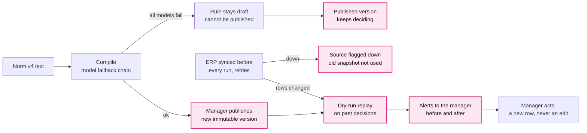

# E. Change without code, recover without loss

**Problem.** The norm and the data change live, the ERP fails on purpose, and LLM providers
go down.

**Decision.** A norm change is configuration: new text, recompiled rules and a new immutable
process version that the manager publishes whole or not at all. History is append-only: a
change is replayed on past decisions as alerts, never as edits. A failed model falls back
to the next one. The ERP is synced before every run; if it is down, its old snapshot is
not used, the source is flagged down and the invoices that need it escalate.

| Option | Why not / trade-off |
|---|---|
| A code change per norm version | The team is needed for every change |
| Activate each rule as soon as it compiles | A failed compile leaves the norm half-applied |
| Rewrite past decisions after a change | We lose what was decided and why |
| **Configuration, atomic versions, append-only history, fallbacks (chosen)** | History grows without limit; the manager must publish and act on alerts |

**Why (measured, `docs/resilience.md`).**
- Every LLM down: 500 invoices uploaded, decided and exported, golden 471/471, 0 tokens.
  The primary model down: `glm5.3` answered.
- A new rule whose compile failed stayed a `draft` that cannot be published: 500 decisions
  unchanged. Recompiled and published: 38 stale-decision alerts in 1.1 s.
- `kill -9` after 68 of 500 uploads: the rerun ended with 500 instances, no duplicates. A
  restored backup matches the md5 of all 503 decisions.
- ERP down before a run: the sync gave up after 15.4 s, no old snapshot was used, and
  `/health/planes` showed ingestion `degraded` (`sources down: 2:erp`).

**In practice.** #77 added a near-miss IBAN check (R17: 1-4 characters from the master
escalates) to the live pack as configuration; the frozen delivery rule set is unchanged.

**Cost.** A new norm waits for a manager's publication, and an ERP outage costs
escalations until it is back.

Detail: [0007](detail/0007-declarative-process-packs.md),
[0008](detail/0008-immutable-history-and-retroactive-audit.md),
[0011](detail/0011-configuration-layers.md),
[0013](detail/0013-fault-tolerant-erp-client.md),
[0015](detail/0015-immutable-process-versions.md),
[0019](detail/0019-llm-fallback-chain.md),
[0022 versions](detail/0022-publish-approved-process-versions.md),
[0023](detail/0023-fal-visual-fallback-evaluation.md),
[0024](detail/0024-discover-processes-through-documents-and-conversation.md),
[0026](detail/0026-stale-decision-alerts.md),
[0027](detail/0027-ocr-execution-modes-and-provider-fallback.md),
[0028](detail/0028-live-sources-sync-before-run.md);
[resilience.md](../resilience.md).
