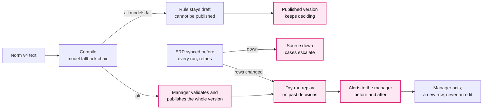

# E. Change without code, recover without loss

**Claim.** A norm change is configuration that the manager publishes whole or not at all.
History is append-only. When a provider fails, deciding goes on; when the data changes,
the manager is told which past decisions are now stale.

**Rubric.** Resilience and recovery (10): "what happens if the LLM provider fails,
rate-limits or returns an invalid answer? How do you keep the work, avoid duplicates,
degrade and recover?" Bonus (10): stale-decision alerts.

**Problem.** Norm v4 arrives on Saturday and a Caja value changes on Sunday. The ERP fails
on purpose, and LLM and OCR providers go down or rate-limit. None of that may lose work,
duplicate a payment, or leave a norm half applied.

**Decision.**
- A norm change is new text, recompiled rules and a new immutable process version. The
  manager validates the draft against past decisions and publishes it whole. A rule that
  failed to compile stays a draft and blocks publication; the published version keeps
  deciding.
- Deciding needs no LLM, so an LLM outage only delays new rules.
- Each agent role has a chain of models: an error, a 429 after retries or a cut answer moves
  to the next one. An invalid answer goes back to the same model with the error.
- Live sources sync before every run. A source that is down is not read from an old
  snapshot: the cases that need it escalate.
- History is append-only. A change is replayed on past decisions as alerts, never as edits.

**Update 2026-09-19 (ADR 0035).** A manager's resolution can become a rule change without code: amend the escalating rule, publish a new version, reprocess. Past decisions stay; similar cases get a new engine row.

## Alternatives considered

| Option | Why we rejected it |
|---|---|
| A code change per norm version | The team is needed for every change, live on stage |
| Activate each rule as soon as it compiles | A failed compile leaves the norm half applied. We had it, and replaced it (ADR 0031) |
| Rewrite past decisions after a change | We lose what was decided and why |
| Retry the same model until it answers | An outage becomes a hang; one provider is a single point of failure |
| **Atomic versions, append-only history, fallback chains (chosen)** | History grows without limit; the manager must publish and act on alerts |

## Evidence

All rows were run live on 2026-09-19 against real Helmcode models ([resilience.md](../resilience.md),
logs in `demo-logs/resilience/`); reported, not re-run for this ADR.

| Jury question | What happened | Log |
|---|---|---|
| LLM provider fails | Every model unreachable: 500 invoices uploaded, decided and exported, golden 471/471, 0 tokens | `05-llm-down-degrade.txt` |
| Primary model down | `deepseek-v4-flash` refused the connection; `glm5.3` answered; the span records the chain | `07-llm-fallback-chain.txt`, `make demo-llm-down` |
| Rate limit | A 429 with `Retry-After`: 3 requests, then the next model answered | `07-llm-fallback-chain.txt` |
| Invalid or cut answer | A cut answer (`finish_reason: length`) moved to the next model; a malformed one is sent back with the error, at most 2 times | `07-llm-fallback-chain.txt`; `agents/tests/test_compiler.py` |
| Keep the work | A new rule whose compile failed stayed a draft; 500 decisions unchanged. Recompiled and published: 38 stale-decision alerts in 1.1 s | `05-…`, `06-llm-recover-rule.txt` |
| Avoid duplicates | `kill -9` after 68 of 500 uploads: the rerun ended with 500 instances, none duplicated. Two runs: the second decided 0 | `01-kill-mid-ingestion.txt`, `02-avoid-duplicates.txt` |
| Recover | A restored backup matches the md5 of all 503 decisions and the export line by line | `03-append-only-and-backup.txt` |
| A source fails | ERP down: the invoices that need it escalate `SOURCE_UNAVAILABLE: erp`; the others are decided | `decisions/tests/test_live_sources.py`, re-run in `make test` |

**Bonus: stale-decision alerts.** When a sync changes source rows or a new version is
published, the engine replays past decisions in a dry run and opens one alert per decision
that would change, with its before and after. The manager acknowledges it or reprocesses;
the old decision stays. Endpoints: `GET /processes/{id}/alerts`, `POST /alerts/{id}/ack`
(`demo-logs/alerts/`).

## Trade-offs accepted

- A new norm waits for the manager's publication; nothing goes live on its own.
- An ERP outage costs escalations until it is back.
- A scan decided while an OCR provider was down stays escalated; the manager resolves it
  (known gap, `docs/resilience.md`).

## See it in the demo

- **Definición**: edit the norm, validate the draft (what would change, and which cases a
  person already resolved), publish.
- **Panel** and **Revisión**: stale-decision alerts with before and after, and *acknowledge*.
- Terminal: `make demo-llm-down` prints the span where the fallback model answered.

Detail: [0007](detail/0007-declarative-process-packs.md),
[0008](detail/0008-immutable-history-and-retroactive-audit.md),
[0011](detail/0011-configuration-layers.md),
[0013](detail/0013-fault-tolerant-erp-client.md),
[0015](detail/0015-immutable-process-versions.md),
[0019](detail/0019-llm-fallback-chain.md),
[0023](detail/0023-fal-visual-fallback-evaluation.md),
[0024](detail/0024-discover-processes-through-documents-and-conversation.md),
[0026](detail/0026-stale-decision-alerts.md),
[0027](detail/0027-ocr-execution-modes-and-provider-fallback.md),
[0028](detail/0028-live-sources-sync-before-run.md),
[0031](detail/0031-publish-approved-process-versions.md),
[0032](detail/0032-single-manager-without-login.md),
[0033](detail/0033-one-proposals-contract.md);
[resilience.md](../resilience.md).
