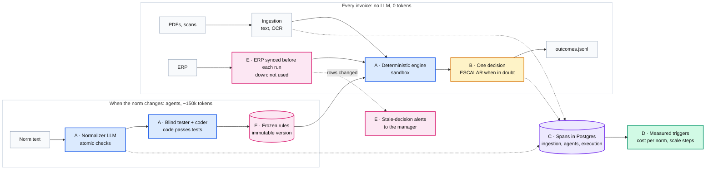

# Architecture decisions

Five key decisions explain trace-it; each answers one criterion of the jury's rubric. Read
them in one page: [key-decisions.md](../key-decisions.md) (about 3 minutes). Every other ADR
supports one of them and lives in [`detail/`](detail/).

| | Decision | Rubric | One line |
|---|---|---|---|
|  | [The LLM writes code; it never decides](A-llm-writes-code-never-decides.md) | Product and architecture (35) | Agents compile the norm to tested code; a deterministic engine decides at 0 tokens per invoice |
|  | [When in doubt, ESCALAR](B-when-in-doubt-escalate.md) | Validation and quality | One decision per file: non-compliance is `NO_PAGAR`, anything undetermined is `ESCALAR` with its reason |
|  | [Full traceability in three planes](C-traceability-in-three-planes.md) | Traceability (20) | Our own spans in Postgres are the audit, mirrored to OpenTelemetry: ingestion, agents, execution |
|  | [Cost per norm, not per invoice; scale by measured limits](D-cost-per-norm-scale-by-measure.md) | Scale and cost (25) | Tokens are spent when the norm changes; one small server; each scaling step has a measured trigger |
|  | [Change without code, recover without loss](E-change-without-code-recover-without-loss.md) | Resilience (10) and bonus (10) | A norm is configuration published as an atomic version; history is append-only; failures fall back |

Supporting ADRs (30)

ADR 0001 is the founding decision and wins over any other document. Superseded plans live
in `.artifacts/archive/`.

| ADR | Decision | Status | Key |
|---|---|---|---|
| [0001](detail/0001-configurable-decision-process.md) | Build a configurable decision process with reviewed learning | accepted | A |
| [0002](detail/0002-deterministic-engine-llm-never-decides.md) | Decide with a deterministic engine; the LLM never decides at runtime | accepted | A |
| [0003](detail/0003-rules-compiled-to-python-by-agents.md) | Compile each rule's text to free Python code with agents | accepted | A |
| [0004](detail/0004-blind-tester-and-autonomous-coder.md) | Verify generated rule code against a blind tester | accepted | A |
| [0005](detail/0005-in-house-sandbox-for-rule-code.md) | Run rule code in an in-house sandbox | accepted | A |
| [0006](detail/0006-pydanticai-agent-framework.md) | Build every agent on PydanticAI | accepted | A |
| [0007](detail/0007-declarative-process-packs.md) | Keep all domain knowledge in declarative process packs | accepted | E |
| [0008](detail/0008-immutable-history-and-retroactive-audit.md) | Never rewrite history | accepted | E |
| [0009](detail/0009-review-state-and-export-semantics.md) | Treat REVIEW as an internal state | superseded by 0016 | B |
| [0010](detail/0010-double-extraction-with-deterministic-validators.md) | Extract symbols with two readings and deterministic validators | superseded by 0022 | B |
| [0011](detail/0011-configuration-layers.md) | Separate bootstrap files, versioned runtime configuration and secrets | accepted | E |
| [0012](detail/0012-stack-and-feature-based-structure.md) | Use FastAPI, PostgreSQL and a feature-based layout | accepted | D |
| [0013](detail/0013-fault-tolerant-erp-client.md) | Read the ERP only through a fault-tolerant client | accepted | E |
| [0014](detail/0014-rules-only-decision-step.md) | Combine rule findings by decision-type priority only | superseded by 0021 | A |
| [0015](detail/0015-immutable-process-versions.md) | Snapshot the whole process as an immutable version | accepted | E |
| [0016](detail/0016-every-instance-gets-a-decision.md) | Decide every instance: a rule that cannot be evaluated escalates | accepted | B |
| [0017](detail/0017-autonomous-norm-normalizer.md) | Turn the client's norm into rules with an autonomous normalizer | accepted | A |
| [0018](detail/0018-observability-own-audit-spans-plus-opentelemetry.md) | Trace every step as spans in our database, mirrored to OpenTelemetry | accepted | C |
| [0019](detail/0019-llm-fallback-chain.md) | Move to the next model of a per-role chain when a provider fails | accepted | E |
| [0020](detail/0020-deployment-and-scaling-plan.md) | Deploy as one small server with a remote LLM; scale by measured triggers | proposed | D |
| [0021](detail/0021-optional-decision-review.md) | Review engine decisions with optional advice and human approval | accepted | B |
| [0022](detail/0022-ocr-evidence-and-provider-tracing.md) | Preserve OCR evidence and trace each provider operation | accepted | C |
| [0022](detail/0022-publish-approved-process-versions.md) | Require manager publication of complete process versions | accepted | E |
| [0023](detail/0023-fal-visual-fallback-evaluation.md) | Evaluate fal.ai visual readers before a production fallback | proposed | E |
| [0024](detail/0024-discover-processes-through-documents-and-conversation.md) | Build process drafts through documents and conversation | accepted | E |
| [0025](detail/0025-scan-decision-policy.md) | Decide scans only on confirmed data | accepted | B |
| [0026](detail/0026-stale-decision-alerts.md) | Flag stale decisions to the manager; never rewrite them | accepted | E |
| [0027](detail/0027-ocr-execution-modes-and-provider-fallback.md) | Configure local/API/hybrid OCR and bounded provider fallback | accepted | E |
| [0028](detail/0028-live-sources-sync-before-run.md) | Sync live sources before every run; fail closed when one is down | accepted | B, E |
| [0029](detail/0029-bind-dynamic-extraction-to-published-execution.md) | Bind dynamic extraction to published execution and evidence | accepted | B, E |

### Glossary
- **Rule finding:** the result of one rule on one instance (`fires`, `reason`).
- **Audit finding:** a past decision that a newer process version would decide
  differently. Stored in the table `findings`.
- **Manager:** the human role that approves rule and process changes and owns the final
  decision of escalated cases. Not "approver" or "responsable".
- **Engine decision / final decision / exported decision:** the process output; the
  manager's decision for an escalated case; the one written to the export, which is the
  engine's (ADR 0016).
- **Process version:** an immutable, published configuration approved for future executions.
- **Process draft:** proposed configuration awaiting validation and manager publication.
- **Execution:** one evaluation of cases using a fixed process version and captured evidence.

### Adding an ADR
1. Copy [`detail/template.md`](detail/template.md) to `detail/NNNN-kebab-title.md` with the
   next free number.
2. Title it with the decision itself, in the imperative ("Use X", "Never do Y").
3. Fill Context, Alternatives considered (pros and cons for each), Decision, Consequences
   (what we accept losing), Evidence (measured numbers, tests, code references) and
   Related. Aim for 40-90 lines.
4. Start as `status: proposed`. Switch to `accepted` in the PR that implements it.
5. Every PR that takes an architecture decision adds or updates its ADR. Do not rewrite an
   accepted ADR's decision: write a new one and mark the old one `superseded`
   (with `superseded_by: NNNN`).
6. Add a row to the table above, with the key decision it supports. Update that key
   decision if its one line or its numbers change.

English only. Use the domain names above.

