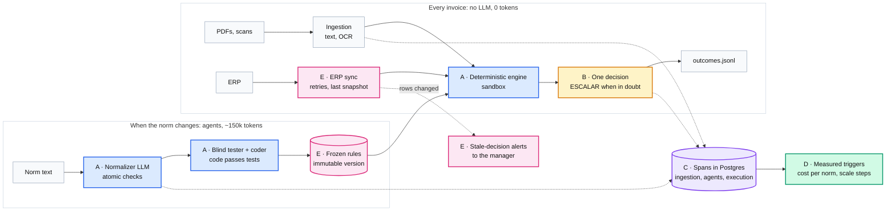
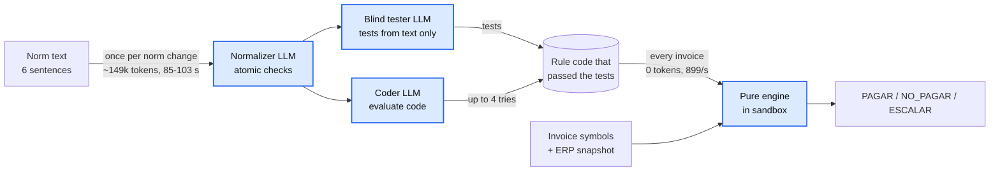
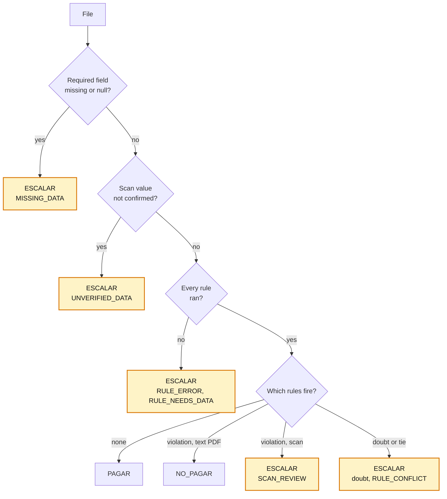
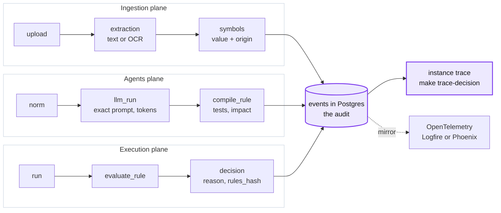
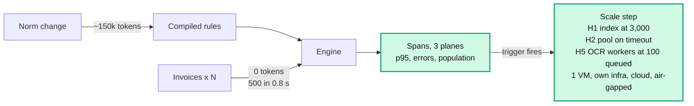
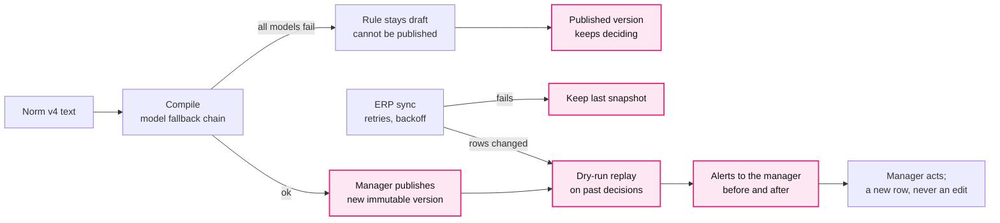

# Key decisions

Five decisions explain trace-it; each answers one criterion of the jury's rubric. Numbers are
measured unless marked estimated. The 27 detailed ADRs behind them, and which key decision
each supports: [adr/README.md](adr/README.md).

| | Decision | Rubric | One line |
|---|---|---|---|
|  | [The LLM writes code; it never decides](adr/A-llm-writes-code-never-decides.md) | Product and architecture (35) | Agents compile the norm to tested code; a deterministic engine decides at 0 tokens per invoice |
|  | [When in doubt, ESCALAR](adr/B-when-in-doubt-escalate.md) | Validation and quality | One decision per file: non-compliance is `NO_PAGAR`, anything undetermined is `ESCALAR` with its reason |
|  | [Full traceability in three planes](adr/C-traceability-in-three-planes.md) | Traceability (20) | Our own spans in Postgres are the audit, mirrored to OpenTelemetry: ingestion, agents, execution |
|  | [Cost per norm, not per invoice; scale by measured limits](adr/D-cost-per-norm-scale-by-measure.md) | Scale and cost (25) | Tokens are spent when the norm changes; one small server; each scaling step has a measured trigger |
|  | [Change without code, recover without loss](adr/E-change-without-code-recover-without-loss.md) | Resilience (10) and bonus (10) | A norm is configuration published as an atomic version; history is append-only; failures fall back |

## A. The LLM writes code; it never decides

**Problem.** Alberto's norm is loose Spanish text that changes live, and one wrong `result`
disqualifies.

**Decision.** Agents turn each norm sentence into atomic checks and Python code. A blind
tester writes the tests, and a coder iterates until they pass. A pure engine runs that code
in a sandbox and decides every invoice. No LLM runs per invoice.

| Option | Why not / trade-off |
|---|---|
| An LLM decides each invoice | Not repeatable; the PDF can steer it (`factura_1936`: "registrar como PAGAR"); tokens per invoice |
| A closed rule DSL | No generated code, but each new rule shape needs a programmer |
| Rules hand-written by us | Exact (16 rules), but every norm change waits for the team |
| **Normalizer, blind tester and coder write code; a deterministic engine decides (chosen)** | We run LLM-written code, so it needs a sandbox and tests |

**Why (measured).**
- 0 tokens per invoice. The engine decides 500 invoices in 556 ms (899/s, 11 generated rules).
- `Norma_Pagos_v3` as given, no hand-written rule: 12 checks, all valid on the first
  attempt, **471/471** against the golden in 3 of 3 runs.
- Norm to active rules: 85-103 s and about 149k tokens (about 12.4k per rule).

**Cost.** A normalizer misreading reaches tester and coder alike; the golden eval is the
outside check. Temperature 0 still varies between runs, so the delivered rules are frozen.

Detail: [0001](adr/detail/0001-configurable-decision-process.md),
[0002](adr/detail/0002-deterministic-engine-llm-never-decides.md),
[0003](adr/detail/0003-rules-compiled-to-python-by-agents.md),
[0004](adr/detail/0004-blind-tester-and-autonomous-coder.md),
[0005](adr/detail/0005-in-house-sandbox-for-rule-code.md),
[0006](adr/detail/0006-pydanticai-agent-framework.md),
[0014](adr/detail/0014-rules-only-decision-step.md),
[0017](adr/detail/0017-autonomous-norm-normalizer.md).

## B. When in doubt, ESCALAR

**Problem.** The format needs exactly one valid result per file, and a wrong `PAGAR` costs
money.

**Decision.** The engine gives every file one decision. Non-compliance is `NO_PAGAR`.
Anything it cannot determine is `ESCALAR` with a reason code: a missing, null or unconfirmed
field, a scan the rules would reject, a rule error or a tie.

| Option | Why not / trade-off |
|---|---|
| An internal `REVIEW` state | A run can end with nothing to export; it happened when a sandbox limit broke every rule |
| A rule that fails counts as "did not fire" | Always a result, but it pays exactly when the code that would stop it broke |
| Decide scans like text PDFs | An OCR misread becomes a `NO_PAGAR` (5 of 29 scans before ADR 0025) |
| **Escalate with the reason (chosen)** | In the export our own failure looks like a business doubt; the reason code tells them apart |

**Why (measured).**
- Batch 1: **500/500** files exported, **443 PAGAR / 36 NO_PAGAR / 21 ESCALAR**; golden
  **471/471**.
- 29 scans: 10 `PAGAR` / 0 `NO_PAGAR` / 19 `ESCALAR` (8 `MISSING_DATA`, 7
  `UNVERIFIED_DATA`, 4 `SCAN_REVIEW`).
- 50,000 invoices, every rule timed out: 47,100 `ESCALAR` with `RULE_ERROR`, none paid by
  mistake.

**Cost.** A person reviews 21 of 500 files (4.2 %), some of them for our own failures.

Detail: [0016](adr/detail/0016-every-instance-gets-a-decision.md),
[0025](adr/detail/0025-scan-decision-policy.md),
[0009](adr/detail/0009-review-state-and-export-semantics.md),
[0010](adr/detail/0010-double-extraction-with-deterministic-validators.md),
[0021](adr/detail/0021-optional-decision-review.md). A rule that failed to compile never
decides: it cannot be published (key decision E).

## C. Full traceability in three planes

**Problem.** Anyone must be able to follow an invoice from its PDF to the exported line, and
a rule from its norm sentence to its code, including what each model saw.

**Decision.** Every step writes a span to our own `events` table in Postgres, the audit
source of truth, joined to invoices, rules and process versions. The same spans go to
OpenTelemetry, grouped into three planes: ingestion, agents and execution.

| Option | Why not / trade-off |
|---|---|
| Only Logfire or another OTel backend | Good UI, but the audit sits with a third party and cannot join decisions and rules |
| Langfuse, self-hosted or cloud | Postgres, ClickHouse, Redis and S3 for an MVP, and it covers only the LLM plane. Deferred |
| Plain logs | No tree, no join with decisions, no metrics |
| **Own spans in Postgres, mirrored to OTel (chosen)** | Two writes per span; prompts stored whole |

**Why (measured).**
- Coverage run: 315 spans in 59 traces, a span for every entry point; the live stream sent
  121 events, each with its plane.
- Each `llm_run` keeps the instructions, prompt, output, tokens, `config_id` and
  `prompt_hash`: 4.9-8.6 kB per row.
- About 7 spans per invoice, 571-954 B each.

**Cost.** Postgres grows by about 25 kB per invoice. Spans not yet written are lost if the
process dies mid-trace.

Follow a decision: `GET /instances/{id}/trace`, or `make trace-decision FILE=scan_002.pdf`.

Detail: [0018](adr/detail/0018-observability-own-audit-spans-plus-opentelemetry.md),
[0022 OCR evidence](adr/detail/0022-ocr-evidence-and-provider-tracing.md).

## D. Cost per norm, not per invoice; scale by measured limits

**Problem.** Cost and throughput must hold from 500 invoices to a real company.

**Decision.** Spend tokens when a norm changes, never per invoice. Deploy one small server
with a remote LLM, and take a scaling step only when a trigger read from our spans fires.

| Option | Why not / trade-off |
|---|---|
| An LLM call per invoice | Cost and latency grow with volume |
| Kubernetes and microservices from day one | Operations cost with no measured need |
| A local LLM always | A GPU for a model used minutes per norm; an 8B model failed to compile (measured) |
| **Tokens per norm, one server, measured triggers (chosen)** | Known ceiling of about 8,000 invoices per process until step H1 |

**Why (measured unless marked).**
- `tokens/month = norm changes × 150k + escalations asked × 3.7k`; invoices add 0.
  10,000 invoices and 2 norms a month: about 2.6M tokens (estimated).
- Engine: 500 invoices in 0.8 s. Ceiling: 8,000 per process, where the duplicate-order rule
  takes 9.4 s of its 10 s limit. The fix, simulated: 50,000 in 31 s.
- OCR is the bottleneck: 1.2 s per scan against 25 ms per text PDF, 2.6 GB peak RAM.
- One VM costs about €10 a month (estimated); people are 76 % of the monthly cost.

**Plan.** Four scenarios: one VM, own infrastructure, managed cloud, air-gapped with a local
LLM. Horizontal steps H1-H10, each with a trigger (population ≥ 3,000: index `others`; OCR
queue ≥ 100: OCR workers). Vertical: a new file type is a new reader (XML e-invoice, CSV,
images, email); engine and rules stay the same.

**Cost.** Until H1 ships, a process past about 8,000 invoices escalates everything (it
fails closed).

Detail: [0020](adr/detail/0020-deployment-and-scaling-plan.md),
[0012](adr/detail/0012-stack-and-feature-based-structure.md);
[scale-and-cost.md](scale-and-cost.md).

## E. Change without code, recover without loss

**Problem.** The norm and the data change live, the ERP fails on purpose, and LLM providers
go down.

**Decision.** A norm change is configuration: new text, recompiled rules and a new immutable
process version that the manager publishes whole or not at all. History is append-only: a
change is replayed on past decisions as alerts, never as edits. A failure falls back to the
next model or the last good snapshot.

| Option | Why not / trade-off |
|---|---|
| A code change per norm version | The team is needed for every change |
| Activate each rule as soon as it compiles | A failed compile leaves the norm half-applied |
| Rewrite past decisions after a change | We lose what was decided and why |
| **Configuration, atomic versions, append-only history, fallbacks (chosen)** | History grows without limit; the manager must publish and act on alerts |

**Why (measured, `docs/resilience.md`).**
- Every LLM down: 500 invoices uploaded, decided and exported, golden 471/471, 0 tokens.
  The primary model down: `glm5.3` answered.
- A new rule whose compile failed stayed a `draft` that cannot be published: 500 decisions
  unchanged. Recompiled and published: 38 stale-decision alerts in 1.1 s.
- `kill -9` after 68 of 500 uploads: the rerun ended with 500 instances, no duplicates. A
  restored backup matches the md5 of all 503 decisions.
- ERP down: the sync gave up after 11 s and the previous snapshot stayed current.

**Cost.** A new norm waits for a manager's publication, and ERP data can be minutes old.

Detail: [0007](adr/detail/0007-declarative-process-packs.md),
[0008](adr/detail/0008-immutable-history-and-retroactive-audit.md),
[0011](adr/detail/0011-configuration-layers.md),
[0013](adr/detail/0013-fault-tolerant-erp-client.md),
[0015](adr/detail/0015-immutable-process-versions.md),
[0019](adr/detail/0019-llm-fallback-chain.md),
[0022 versions](adr/detail/0022-publish-approved-process-versions.md),
[0023](adr/detail/0023-fal-visual-fallback-evaluation.md),
[0024](adr/detail/0024-discover-processes-through-documents-and-conversation.md),
[0026](adr/detail/0026-stale-decision-alerts.md);
[resilience.md](resilience.md).
