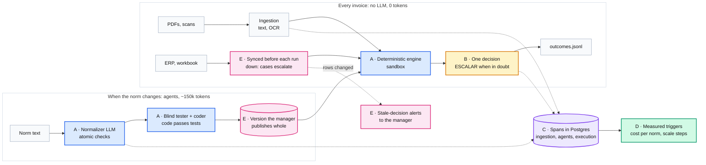

# Key decisions

Five decisions explain trace-it, and each one answers a criterion of the jury's rubric. Every
number below is either re-measured on `dev` for this page or marked as reported (measured
earlier by the team, with its log) or estimated. Each decision has a two-minute page in
[`adr/`](adr/README.md), and 34 detailed ADRs sit behind them.

| | Decision | Rubric | Claim |
|---|---|---|---|
|  | [The LLM writes code; it never decides](adr/A-llm-writes-code-never-decides.md) | Product, architecture and ADRs (35) | Agents compile the norm to tested code once; the engine decides 500 invoices in 0.44 s with 0 tokens; golden 471/471 |
|  | [When in doubt, ESCALAR](adr/B-when-in-doubt-escalate.md) | Quality of execution (10) | One decision per file: 443 `PAGAR` / 36 `NO_PAGAR` / 21 `ESCALAR`, each escalation with its reason code |
|  | [Full traceability in three planes](adr/C-traceability-in-three-planes.md) | Traceability and observability (20) | Our own spans in Postgres are the audit; three dashboards show errors, retries, pending work and cost per plane |
|  | [Cost per norm, not per invoice; scale by measured limits](adr/D-cost-per-norm-scale-by-measure.md) | Scale and cost (25) | Tokens are spent per norm and per first scan read, never per decision; each scaling step has a measured trigger |
|  | [Change without code, recover without loss](adr/E-change-without-code-recover-without-loss.md) | Resilience (10) and bonus (10) | Atomic versions the manager publishes, append-only history, fallback chains, stale-decision alerts |

**Who does what.** Agents (LLMs) read scans, turn the norm into rule code and tests, and
propose decisions and changes. The engine (plain code) decides. The manager, the only
role in the console, publishes versions, resolves escalations and accepts or rejects
proposals ([0032](adr/detail/0032-single-manager-without-login.md),
[0033](adr/detail/0033-one-proposals-contract.md)).

## A. The LLM writes code; it never decides

- **Chosen over:** an LLM per invoice (not repeatable, `factura_1936` says "registrar como
  PAGAR", about 1.85M tokens per 500 invoices, estimated); a closed rule DSL (every new rule
  shape needs a programmer); rules written by us (every norm change waits for the team).
- **Proof:** golden **471/471** with the rule set generated from the norm (`make test-e2e`,
  re-run). 500 invoices, 12 rules: **0.44 s** median, 0 tokens (`tools/bench_scale.py
  engine`, re-measured). Norm to rules: 12 checks, 471/471 in 3 of 3 runs, about 149k tokens
  (reported, ADR 0017).
- **Accepted:** we run LLM-written code, so it passes a blind tester, runs in a sandbox and
  waits for publication.
- **See it:** Definición → a rule: norm sentence, code, tests.

## B. When in doubt, ESCALAR

- **Chosen over:** a `REVIEW` state outside the export; counting a failed rule as "did not
  fire"; deciding scans like text PDFs; reading an old ERP snapshot when the ERP is down.
- **Proof:** batch 1: 500 files, **443 / 36 / 21**; the 21 are 8 `MISSING_DATA`, 7
  `UNVERIFIED_DATA`, 4 `SCAN_REVIEW` and 2 duplicate orders (re-measured). 29 scans: 10
  `PAGAR`, 0 `NO_PAGAR` (re-measured). ERP down or never loaded: `SOURCE_UNAVAILABLE`
  (tests, re-run).
- **Accepted:** a person reviews 4.2 % of the files, some for our own limits.
- **See it:** Revisión, the queue with reason codes and explained options.

## C. Full traceability in three planes

- **Chosen over:** only a hosted OTel backend; Langfuse; plain logs; one mixed dashboard.
- **Proof:** follow any invoice with `GET /instances/{id}/trace` or `make trace-decision
  FILE=scan_002.pdf`: PDF evidence, rules, version, `rules_hash`, latency. 3,414 spans for
  the 500-invoice run, 5.0 MB (re-measured). `/metrics/{plane}` gives errors, retries,
  pending work, `known_cost_usd` and `unpriced_requests`.
- **Accepted:** Postgres grows with every span and prompt.
- **See it:** Ejecuciones → a case; Panel → *Detalles técnicos*.

## D. Cost per norm, not per invoice; scale by measured limits

- **Chosen over:** an LLM per invoice; Kubernetes from day one; an always-on local LLM.
- **Proof:** 214,734 tokens in a live run split into ingestion 52k (scans), agents 162k
  (norm), execution **0** (reported). `tokens/month = norms × 150k + escalations asked ×
  3.7k` (estimated). Ceiling about 8,000 invoices per process, with the fix measured in
  simulation: 50,000 in 31 s (reported).
- **Accepted:** until H1 ships, a process past the ceiling escalates everything.
- **See it:** Panel → *Detalles técnicos*, the three dashboards side by side.

## E. Change without code, recover without loss

- **Chosen over:** a code change per norm; activating each rule as it compiles; rewriting
  past decisions; retrying one model forever.
- **Proof** (reported, `docs/resilience.md`): every LLM down, 500 decided and exported,
  471/471. Primary model down, `glm5.3` answered. A failed compile stayed a draft; published
  later, 38 stale-decision alerts in 1.1 s. `kill -9` mid-upload, no duplicates.
- **Accepted:** a new norm waits for the manager; an ERP outage costs escalations.
- **See it:** Definición → validate and publish; the alerts on Panel and Revisión;
  `make demo-llm-down`.

## How the numbers were checked

| Number | Status | How |
|---|---|---|
| 471/471 golden; 723 unit tests pass (2 skipped), 11 e2e pass | re-run | `make check` on `dev` |
| 500 invoices in 0.42-0.49 s (4 rule workers), 0.84 s (1) | re-measured | `bench_scale.py engine`, `capacity`, Apple M4 Pro, copy of the delivery database |
| 443 / 36 / 21 and the escalation causes | re-measured | Same dry-run reprocess: 500 unchanged |
| 3,414 spans, 5.0 MB `events`, 24 MB database | re-measured | Postgres on the same copy |
| 149k tokens per norm, 85-103 s | reported | [scale-and-cost.md](scale-and-cost.md) §2, §6 (needs LLM keys and spends tokens) |
| 214,734 tokens by plane | reported | [observability-dashboards.md](observability-dashboards.md) |
| Resilience runs | reported | [resilience.md](resilience.md), `demo-logs/resilience/` |
| 444 / 36 / 20 with Helmcode OCR | reported, no log in the repo | team run |
| Tokens per month, € per month | estimated | scale-and-cost.md §6 |
